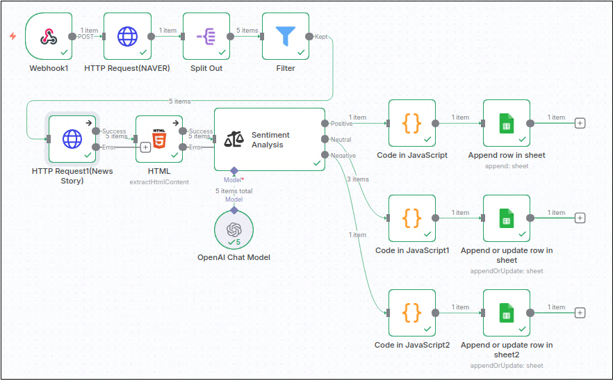
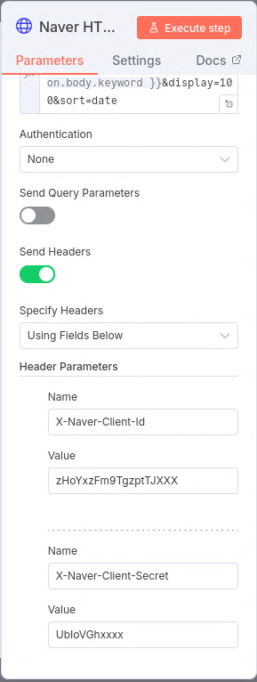
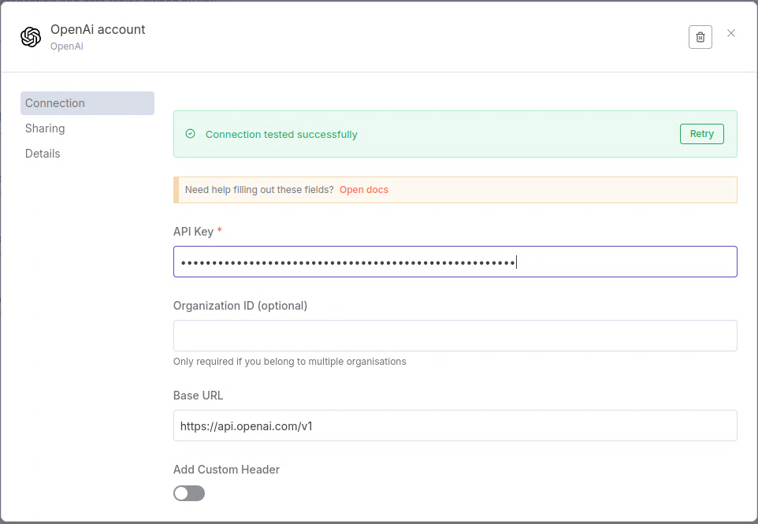
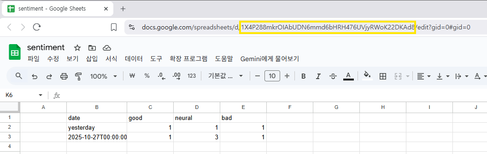

# An n8n example using naver API, web crawling, sentiment analysis and google sheet to show the emotion tone of news article about a keyword

이 workflow는 n8n를 사용해서 naver API를 통해 특정 keyword에 관한 뉴스 기사를 검색하고 오늘 날짜로 된 기사를 웹크로링으로 전문을 모두 가져 옵니다.  그리고 <body>에 포함된 text만 뽑아 sentiment analysis에 넘깁니다. sentiment analysis에는 OpenAPI를 이용합니다. Positive, Neutral 그리고 Negative를 따로 count하는 java script를 거쳐서 Google sheet에 count 수를 기록합니다. 

  
실행에는 서비스 접속을 위한 ID가 각각 필요합니다.  Naver API에는 X-Naver-Client-Id와 X-Naver-Client-Secret를 입력해야 합니다.

https://developers.naver.com/docs/serviceapi/search/news/news.md  참조

OpenAI에는 API key가 있어야 하고 

https://platform.openai.com/api-keys  참조

그리고 Google sheet 사용을 위한 credential은 service account로 만듭니다. 

마지막 google sheet 지정을 위해 ID가 필요한데 URL에서 볼 수 있습니다

ID는 Document에 "By ID"로 지정하고 구글 드라이브에서 해당 파일의 공유 특성도 "편집자"로 변경해야 "시트1"를 볼 수 있고 편집이 가능합니다. 

